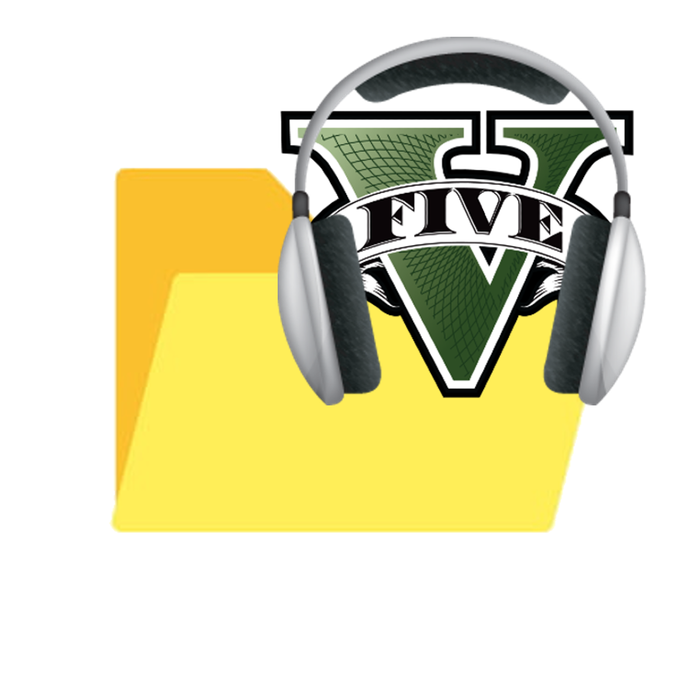

 

  
  <h3 align="center">Music to Music Folder GTA</h3>
  
You are currently reading the repository documentation, happy reading :)

 

# Music to Music Folder GTA Repository
Just have to run a program that copies all your music from your folder on your computer called "Music" which will be automatically copied to the GTA V folder where it will allow you to have your own personalized radio with your own sounds in game.

The files authorized for music are in .mp3.

# Utilization
Please follow the following steps :
1. Download the repository
2. Right click on the file “Music To GTA V.ps1”
3. Do "run with powershell"
4. Congratulations ! The music in your "Music" folder on your PC is now copied to the Music folder in GTA V

 

# Support and Feedback
If you encounter any issues or have suggestions for improving Music to Music Folder GTA, please feel free to contact our support team at contact@tsukizo.fr

 

### Thank you for using Music to Music Folder GTA